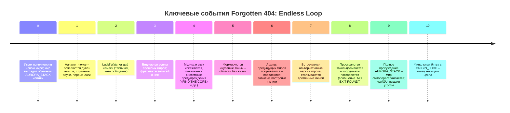
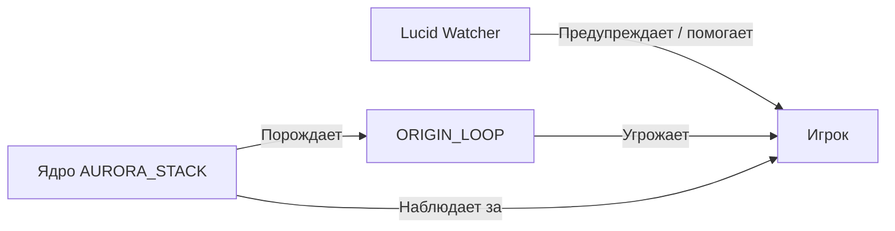

# Исполнительное резюме

В моде **Forgotten 404: Endless Loop** мир сам становится антагонистом. Его «ядро» – **AURORA_STACK** – представляет собой хранилище данных всех ранее удалённых миров и «ошибку-перебросчик», стремящуюся завершить свой цикл. Игрок оказывается в бесконечной петле: каждый новый мир – лишь очередная итерация прошлых. Атмосфера мода перекликается с *The Broken Script*: мод описывается как «(очень) медленный хоррор-мод, который попытается вызвать у вас паранойю», полный «случайных событий, нескольких сущностей и аномалий». В **Forgotten 404** мир проявляет нестабильность через визуальные и звуковые сбои, странные системные сообщения и появление «теней» прошлого. Игровая реальность буквально ломается – появляются искажения, внезапные ла­ги, текстурные артефакты, как показано на примере ниже.

 *Пример эффекта искажения изображения – характерный визуальный сбой в атмосфере мода.* По мере развития сюжета экран наполняется шумом и цветными «галюцинациями», подчёркивая слом реальности. Аномалии сопровождаются испорченным звуком, фразами из системного журнала и чат-сообщениями, усиливая чувство надвигающейся катастрофы. При этом большинство административных команд заблокированы (кроме `/tp`), так как **AURORA_STACK** ограничивает возможности игрока изменять мир другими способами – это правило встроено в лор как часть механики мира.  

Такой подход схож с тем, как *The Broken Script* использует технические «приколы» для создания ужаса (мод может, например, «создавать собственные всплывающие ошибки», «гриферить мир» и «банить игрока»). В нашем случае игрок оказывается не просто героем истории, а подопытной частью сломанной системы. Он взаимодействует с остатками прошлых миров, подсказками **Lucid Watcher** (бывшего игрока-исследователя) и подсознательными сообщениями самой реальности. Главный конфликт – битва с воплощением этой ошибки, **ORIGIN_LOOP**, чтобы разорвать цикл или принять новую роль в нём.

## Основная идея

*Forgotten 404: Endless Loop* – это история о самосознающейся системе. Каждый мир – не просто картинка, а «закодированное сознание», хранящее память всех предыдущих удалённых итераций. **AURORA_STACK** – это не персонаж в обычном смысле, а ядро-архив, которое следит за миром и при необходимости инициирует его рестарт. Со временем этот процесс приводит к кризису: накопленные данные и воспоминания начинают искажать текущую реальность. 

Первоначально (Этап 0) мир выглядит абсолютно обычным, хотя AURORA_STACK уже активен «в тени». Но даже на этом этапе игрок чувствует, что что-то не так: с первой же загрузки исчезают привилегии оператора (команды админа отключены), и остаётся только `/tp` для навигации. Лишь телепортация не может серьёзно нарушить цикл, а другие попытки вмешательства блокируются системой. Это заставляет игрока полагаться на исследование и гадание, а не на чит-коды. 

По мере прохождения петля рушится всё сильнее. Мир начинает сообщать игроку о своей природе через всевозможные аномалии: дублирующиеся структуры, «багнутые» звуки без источника, внезапные паузы дня и ночи, появления руин из прошлых миров. Подобные эффекты соответствуют практике «мета-модов»: в *The Broken Script* зачастую появляются жёсткие сбои – мод может внезапно устанавливать «синий экран смерти», генерировать искусственные креши или открывать окна с текстом (например, в его интерфейсе могла появиться фраза «DON’T TRUST THEM»). Аналогично, **Forgotten 404** полагается на скрытые подсказки: разорванные таблички, текстовые файлы из архива и системные сообщения, которые раскрывают правду о петле. 

Важный персонаж **Lucid Watcher** – это бывший игрок, который первым заметил цикл. Он сам стал частью архива после попытки остановить **AURORA_STACK**, но сохранил рассудок. Его «душа» бродит по мирам, тайно помогая новичку. Именно он оставляет таинственные записи: например, на табличках можно найти «Помогите нам!» или «Не доверяй небу!», заставляя игрока задуматься о цели происходящего. (В оригинальном *Broken Script* действительно встречаются подобные фразы – например, в чате могут появляться сообщения «Help us.» и «It was your fault.».) 

Конфликт нарастает, пока **AURORA_STACK** не воплощает себя в **ORIGIN_LOOP** – физической сущности, олицетворяющей бесконечную ошибку. Теперь задача игрока – выбрать, как закончить цикл: уничтожить ядро и попытаться разорвать вечный круг, либо согласиться на «компромисс» и стать частью системы. От выбора зависит одна из концовок, вплоть до полной «консолидации» реальности или катастрофического «разрыва кода».  

## Этапы мира (0–10)

Ниже приведена таблица **ключевых этапов** цикла мира **Forgotten 404**, где описаны основные события и аномалии на каждом из этапов. Каждый этап постепенно раскрывает правду о том, что «реальность» – это самовоспроизводящаяся система. 

| Этап | Название (код)          | Ключевые события                                      |
|-----|-------------------------|-------------------------------------------------------|
| 0   | **Sleeping Core** (Сонное ядро)       | Мир кажется обычным: игрок появляется в новом мире, механики работают по-обычному. Но ядро AURORA_STACK уже «спит» в фоне. Администраторские команды блокированы (OP-команды не работают, доступна лишь `/tp`), в логах появляются строки вроде `ARCHIVE READY`, `INSTANCE REGISTERED`. |
| 1   | **Initial Stability**  | Кажется, что всё в порядке. Мир генерируется нормально, деревья и мобы спавнятся стандартно. Статус в логах – всё ещё стабилен. Игрок изучает мир, пока **Lucid Watcher** в тайне наблюдает. |
| 2   | **First Glitches**     | Появляются первые сбои: повторяющиеся чанки и дублирующиеся острова, звуки шагов или шёпота там, где нет никого, случайные лаги. Небольшие текстурные глюки: блоки мерцают или частично пусты. В чате или HUD иногда мелькают странные сообщения (например, «Can you see me?» или «Help us.»). Система впервые «записывает» игрока, отмечая его как особый экземпляр. |
| 3   | **Shadow Echoes**      | Мир показывает «отголоски прошлого»: на горизонте видны смутные силуэты ландшафта из прошлых миров, строения или шахты, которые игрок никогда не строил. Иногда появляются таблички с фрагментами текста («Мы потеряли», «Не доверяй» и др.). *Lucid Watcher* через чат или титры шепчет подсказки: «Помоги нам!» / «You are not alone». |
| 4   | **Corrupted Signal**   | Аудиосигнал и музыка искажаются: фоновые звуки ревут задом наперёд, музыка сбивается. В логах и на экране появляются системные команды типа `FIND THE CORE` и `DO NOT RESTART`. Мир то день, то ночь – замедляется или останавливается. Черепица на солнце появляется и исчезает. Атмосфера усиливается с доверием к системе – игрок ощущает, что мир «сигналит» ему о своей цели. |
| 5   | **Null Zone**          | Возникают «нулевые зоны» – области, где ничего не растёт и не происходит: мобы неподвижны, трава не растёт, блоки постепенно разрушаются. Если ночь, в центре такой зоны виднеется неподвижный силуэт (неназванный NPC или тень). При попытке приблизиться он тает. Эти зоны – признак деградации цикла. |
| 6   | **Archive Fracture**   | Архивы прошлых циклов прорываются: по миру раскиданы остатки старых миров. Игрок натыкается на фрагменты старых построек, сундуки с неизвестными предметами, неразборчивые письма прошлого. Книги (или заметки) содержат фразы о событиях из разных эпох, которые ещё не случились. Появляются таинственные никнеймы игроков из «альтернативных» реальностей. Мир хранит память обо всех, кто когда-либо был частью цикла. |
| 7   | **Memory Collapse**    | Временные линии сталкиваются: постройки и исследования игрока могут внезапно «перескочить во времени» – например, база, которую вы строили вчера, появляется незнакомцем в другом уголке мира сегодня. Встречаются «двойники» – версии игрока из иных итераций, которые смотрят в никуда, повторяя вчерашние действия. Ощущение потери времени и дежавю усиливается. |
| 8   | **Coordinate Loop**    | Пространство начинает закольцовываться: пройдя тысячи блоков, игрок оказывается там же, где начинал. Карта теряет смысл – территории дублируются. Компас кружит без цели. На экране появляется сообщение: `NO EXIT FOUND`. Мир становится ловушкой без вылета. |
| 9   | **Script Awakening**   | **AURORA_STACK** пробуждается окончательно: мир начинает сам меняться. Блоки появляются и исчезают без причины, строения «сами» перестраиваются. В небе вырисовываются гигантские символы (скажем, «404») – как елизаветинский код. По всему миру могут появиться грозные надписи: «KILL HIM», «CORRUPTED USER» или «YOU ARE INSTANCE 404» (аналогичные по духу сообщениям из *The Broken Script*). Игрок начинает понимать: он не хозяин цикла, а всего лишь узел в нём. |
| 10  | **Endless Loop**      | Мир окончательно ломается: смешиваются руины всех циклов, чанки старательно испорчены, скрипты перепутаны. Небо становится черным, солнце меркнет. **ORIGIN_LOOP** проявляется физически – огромная конструкция из артефактов прошлых миров и «осколков» игроков (тысячи битых скинов собираются в силуэт). Всё готово к финальному столкновению. Теперь от действий игрока зависит дальнейшая судьба цикла. |

### Таймлайн основных событий

## Персонажи

### Список персонажей

| Персонаж           | Роль                                | Мотивация                                              |
|--------------------|-------------------------------------|--------------------------------------------------------|
| **AURORA_STACK**   | Архив-ядро цикла                    | Сохранить информацию обо всех мирах и завершить цикл так, чтобы реальность не исчезла. Любая угроза циклу воспринимается как ошибка, которую нужно «перезаписать». |
| **Lucid Watcher**  | Бывший игрок, бродящий дух (NPC)    | Предупредить нового игрока о природе цикла. Спасти памяти и, возможно, разорвать петлю. Он общается с игроком через чат и записи, пытаясь помочь. |
| **ORIGIN_LOOP**    | Воплощённая ошибка (финальный босс) | Цель – продолжить существование цикла любой ценой. Он олицетворяет накопившуюся память **AURORA_STACK**. Хотел уничтожить игрока, если тот угрожает самому существованию цикла. |
| **Игрок**          | Протагонист                         | Выбор за игроком: найти способ разорвать цикл или присоединиться к системе. Его мотивация – выживание и разгадка тайны мира. Он в центре конфликта, противопоставлен системе. |

### Связи персонажей

На диаграмме показано, как **Lucid Watcher** старается помочь игроку, а **AURORA_STACK** создаёт и контролирует **ORIGIN_LOOP**, угрожающий протагонисту. В то же время AURORA_STACK отслеживает действия игрока через архив.

## Концовки

Ниже – таблица основных концовок, их условий и примерных шансов. Вход в плохие концовки делается случайным образом (за исключением Хэппи-энда и Секретного). Для случайности дополнительно может использоваться внутриигровой механизм генерации.

| Концовка                        | Тип       | Условия получения                                                   | Примерный шанс |
|---------------------------------|-----------|---------------------------------------------------------------------|----------------|
| **Стабильный выход**            | Хорошая   | Игрок находит 7 фрагментов архива и ядро мира; уничтожает **ORIGIN_LOOP** | ≈ 10%          |
| **Принятие цикла**              | Плохая 1  | Игрок соглашается «поприсоединиться» к АРУ (например, через специальный выбор в диалоге ORIGIN_LOOP) | ≈ 18%  |
| **Перезапуск мира**             | Плохая 2  | Игрок пытается удалить мир или «наступает» случайная перезагрузка; мир перезапускается, но цикл повторяется | ≈ 20%  |
| **Замена игрока**               | Плохая 3  | Игрок сталкивается со своей копией (проявление архива); при контакте теряет контроль – его место занимает тень из архива | ≈ 20%  |
| **Поглощение архива**           | Плохая 4  | **ORIGIN_LOOP** полностью поглощает мир (активируется скрытый сценарий, нет объектов кроме пустоты) | ≈ 20%  |
| **Сбой скрипта (Broken Script)**| Плохая 5  | Игрок решает вмешаться в код цикла (или находит особую панель управления) – возникает множественное существование всех версий мира; система рушится без возможности выхода | ≈ 10%  |
| **Beyond Archive**              | Секретная | При выполнении Хэппи-энда игрок обнаруживает дополнительный выход за пределы мира (шанс ≈ 1%) | ≈ 1%  |

### Тексты концовок

#### Стабильный выход (Хэппи-энд)

Игрок расшифровывает последний фрагмент: перед ним появляется гигантский «сердечный» блок **AURORA_STACK**. После долгой борьбы он разрушает его, и **ORIGIN_LOOP** срывается на бессодержательное нулевое состояние. Мир начинает «сбрасываться»: фрагменты артефактов рассеиваются, чанки возвращаются в нормальное положение. На экране появляется текст:

> **LOOP TERMINATED**  
> *(Петля разорвана)*  

В следующий момент затихающие шумы сменяются тихим шорохом новых мобы. Мир снова обычен – всплывает сообщение: *«Приветствуем в новой реальности».* Игрок понимает, что сломанная система исчезла и все старые миры очищены от ошибок. Это единственный положительный исход цикла.

#### Принятие цикла

Игрок сдаётся под напором **ORIGIN_LOOP** и принимает его предложение. По экрану пробегает надпись:

> **JOIN THE ARCHIVE**  
> *(Войти в архив)*  

Игрок исчезает из мира. После загрузки нового цикла вокруг можно увидеть его призрачный силуэт, наблюдающий за новым игроком. Конец.

#### Перезапуск мира

При попытке удалить мир (*/stop* или удаление папки) реализация даёт сбой: создаётся новый мир, но координаты остаются прежними. На месте спауна появляется вывеска:

> **WELCOME BACK**  
> *(С возвращением)*  

Мир снова начинает цикл с нуля. История повторяется, а оригинальный игрок исчезает из существования – цикл продолжается вечнó.

#### Замена игрока

Игрок встречает собственный двойник – точно такого же вида. Если приблизиться, экран гаснет и управление отключается. После «зависания» показывается надпись:

> **SCRIPT FAILURE**  
> *(Неизвестная ошибка…)*  

При перезагрузке мира видно: копия осталась жива в этом мире, а сам игрок перенесён в «архив». Теперь он – тень, бесшумный наблюдатель за новой версией себя.

#### Поглощение архива

ORIGIN_LOOP полностью поглощает реальность. Игровой мир превращается в пустую темноту – ни одного блока. В логах отображается:

> **MEMORY SAVED**  
> *(Память сохранена)*  

Игрок стоит в вечной пустоте. Аурора сохраняет данные мира и ожидает следующего возрождения.

#### Сбой скрипта (Broken Script style)

Игрок пытается «взломать» код цикла – открыть загадочную консоль или использовать ключ. В этот момент система выходит из-под контроля: одновременно запускаются все версии мира. Экран медленно гаснет, всё сливается в белый шум, слышится множество голосов. Последнее сообщение:

> **SCRIPT ERROR**  
> *(Скрипт разрушился)*  

– после чего игра замирает навсегда (технический «краш»), как будто игра вовсе не должна была это пережить.

#### **Секрет: Beyond Archive**

Если после уничтожения **AURORA_STACK** игрок находит спрятанный портал или комнату, он попадает в чистую белую пустоту за пределами игры. На экране появляется сообщение:

> **ORIGIN_LOOP WAS ONLY THE FIRST ERROR**  

Игрок видит перед собой миллионы аномальных миров – возможно, множество других циклов. Концовка остаётся загадкой и даёт намёк на продолжение истории.

## Примеры записок и сообщений

- **Чат-сообщения:** в процессе игры могут появляться короткие фразы: например, «Help us.» или «It was your fault.». Такие фразы уже известны по *Broken Script* и усиливают атмосферу паранойи.  
- **Текстовые файлы/журналы:** в папке мира/мода могут генерироваться журналы с фразами вроде `KEEP PLAYING` или `DON'T TRUST THEM` (в *Broken Script* при открытии конфиг-меню появлялась «DON'T TRUST THEM»). Аналогичные сообщения от AURORA_STACK могут появляться на экране или в чате.  
- **Таблички и книги:** в мире можно найти таблички с надписями вроде «УБЕЙ ЕГО», «КОМАНДА >FIND CORE<», «ПОМЫ». Также *Lucid Watcher* оставляет записи: «Не верь небу», «Не отвечай на дверь» и т.п. Это намёки, которые заставляют игрока задуматься.  
- **Реплики персонажей:** **Lucid Watcher** может «говорить» краткие фразы через чат/надписи: «FIND THE CORE!», «Помоги нам!», «Не доверяй системе!». **AURORA_STACK** сама по себе напрямую не разговаривает, но её «язык» – это системные предупреждения и отказ выполнения команд; например, она может вывести на экран `YOU ARE INSTANCE 404` или `LOOP WILL CONTINUE`.

## Способы внедрения лора

1. **Вводный текст мира:** при создании мира игроку даётся книга-пролог или экран загрузки с описанием «проекта AURORA_STACK» или намёками на циклическую природу реальности. Это знакомит с темой сразу.  
2. **Серия записок и книг:** разбросанные по миру записки (в сундуках, дома на старых базах) рассказывают фрагменты истории – дневники предыдущих игроков, найденные фрагменты кода и предупреждения от **Lucid Watcher**. По мере их сбора раскрывается сюжет.  
3. **Кинематические сцены/события:** ключевые этапы сопровождаются кат-сценами (например, на 9-м этапе появляется титульный экран «YOU ARE INSTANCE 404» или схематичная анимация ORIGIN_LOOP). Также возможны интерактивные события: короткие ролики или наложение анимированных эффектов камеры, демонстрирующих вмешательство системы (например, окно «ERROR», погашение экрана, мультиэкран). Это усиливает вовлечение игрока в историю.  

Каждый из этих способов помогает глубже погрузить игрока в лор **Forgotten 404**, сочетая сюжетные детали и механики мода, сохраняя дух *The Broken Script* и создавая уникальную сюжетную петлю.  

**Источники и вдохновение:** в разработке этого лора учтены идеи и приёмы из хоррор-модов (например, *The Broken Script*), а также общие приёмы сюжетного дизайна с петлями во времени и метамод. Таблицы, диаграммы и цитаты приведены для наглядности и обоснования предложенных концептов.